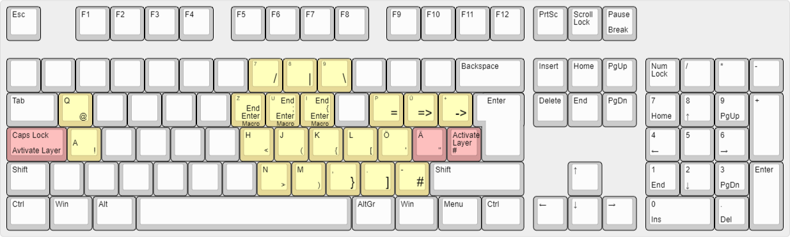
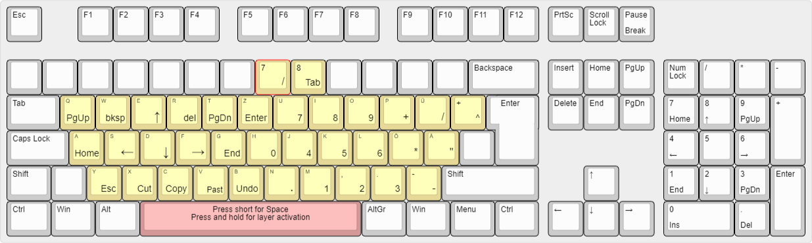

# autohotkey-german-programmer-layer

A lot of characters on the German keyboard which you need for programming are not accessible very well. 

The script adds two layers to the keyboard.
One layer is for easy access to those characters which are needed all the time for programming.
The other layer controls the cursor and have a numberblock.

Both scripts are adapted to German keyboards. But they can easily adapted to other keboards or your own needs.
I realised, that with that script using a QWERTY Keyboard and installing the German keyboard layout is more convenient, because
it is easier to reach the left SHIFT and the RETURN Key. 

Because of the fact that the SPACE and ä keys are used to switching the layer the will fire upon releas.
The advantage is that although the keys will fire upon release, it will do so only if you did not press any other key while it was held down. 

The following layer can be activated by holding Caps Lock, ä or # down. The normal functionality of Caps Lock and the  key # is deactivated!

The following layer can be activated by holding Space down. If you press the Space key short, a Space character is printed (when the Space key is released). If you want a continous printing of Space you have to hold down Space and press s.
The layer was designed like the Ebene 4 of the neo-layout.org - but not exactly.

