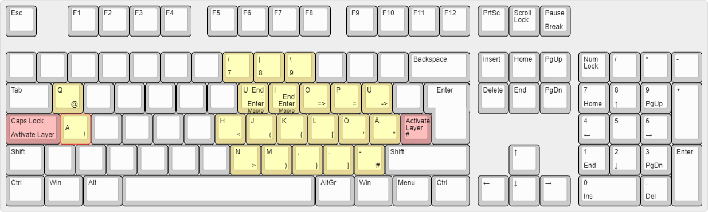
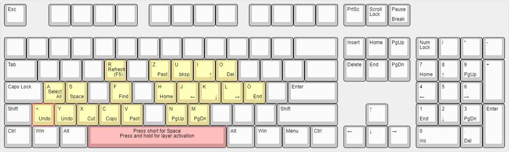

# autohotkey-german-programmer-layer
The script add two layers to the keyboard for easy access to special characters and control the cursor like TouchCursor for German keyboards. It can easily adapted to other keboards.

