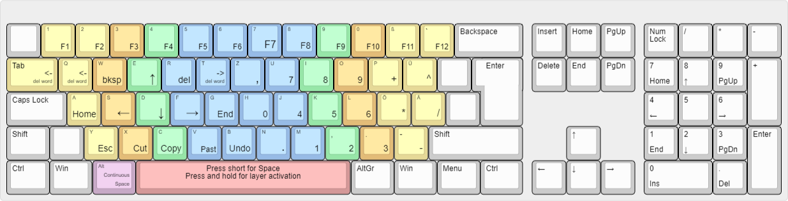

# autohotkey-german-programmer-layout

A Keyboard Layout based on Standard German QWERTZ with the addition of two layers.

To use the script, you have to install [AutoHotKey](https://www.autohotkey.com/).

A lot of characters on the German keyboard which you need for programming are not accessible very well. 

The script adds two layers to the keyboard.
One layer is for easy access to those characters which are needed all the time for programming.
The other layer controls the cursor and have a numberblock.

The script is adapted to German keyboards. But it can be easily adapted to other keboards or your own needs.
I realised, that with that script using a QWERTY Keyboard and installing the German keyboard layout under Windows is more convenient, because
it is easier to reach the left SHIFT and the RETURN Key. 

Because of the fact that the SPACE and ä keys are used to switching the layer they will fire upon releas.
The advantage is that although the keys will fire upon release, it will do so only if you did not press any other key while it was held down. 

The following layer can be activated by holding Caps Lock, ä or # down. The normal functionality of Caps Lock and the  key # is deactivated!

The following layer can be activated by holding Space down. If you press the Space key short, a Space character is printed (when the Space key is released). If you want a continous printing of Space you have to hold down Space and press Alt.
The layer was designed like the Ebene 4 of the neo-layout.org - but not exactly.

Explanation in German:

Die Zeichen wurden so angeordnet, dass diese recht einfach zu erlernen sind.
Da bei der Programmierung die meisten verwendeten Sonderzeichen die Klammern sind, wurden diese auf die rechte Hand und in die mittlere Reihe gelegt. Da moderne IDEs bereits eine Klammer zu automatisch anhängen, wurden diese in die untere Reihe gelegt, da diese weniger verwendet werden. Vielmehr besteht nun der Anspruch, schnell an das Zeilenende zu gelangen und dann dort Enter zu drücken oder "{ und Enter" oder "( und Enter". Diese Kombinationen wurden auf die obere Reihe der Tastatur gelegt.

Hier ein paar Eselsbrücken um sich die Belegung zu merken:

Die spitze Klammer auf zeigt nach links -> Zeigefinger nach links

Runde Klammer sieht aus wir das J unten.

Die rechte Seite vom K sieht aus wie {.

Die Eckigel Klammer ist eckig wie das L.

Die Klammer zu ist unter der Klammer auf.

Das Z ist das Ende des Alphabets. Mit Z springe ich zum Ende der Zeile und drücke Enter.

Über der geschweiften Klammer setze ich eine geschweifte Klammer an das Ende und drücke Enter.

Rechts daneben passiert das gleiche bloß mit einemSemikolen.

Das einfache Anführungszeichen ist klein wie der kleine Finger.

Das doppelte Anführungszeichen ist rechts daneben.

A => Ausrufezeichen

F => Fragezeichen
usw...

Der linke Mittelfingeringer ist der senkrechte Strich und  stellt die mittlere Stange eines Zelte dar.

Links daneben ist die eine Dachschräge (Slash)

Rechts daneben ist die andere Dachschräge (Backslash)

Da bei schnellem Tippen es häufig wesentlich effektiver ist, dass falsche Wort zu löschen und neu zu tippen wurde der "del word" Befehl auf Tab und Q gelegt.

